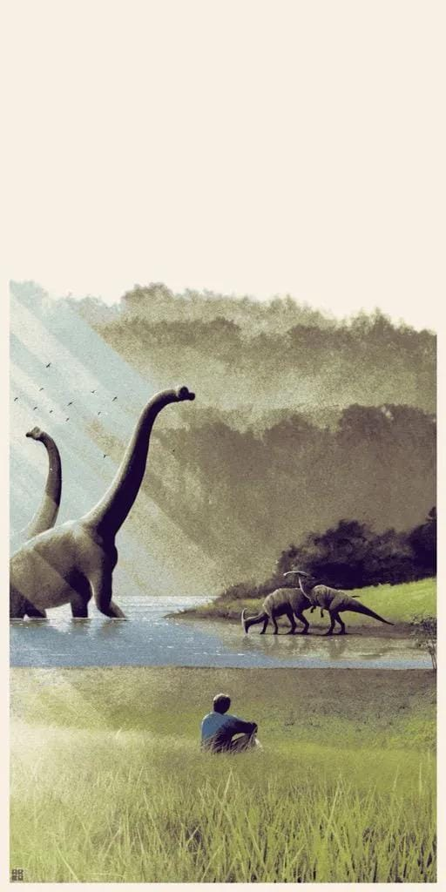

### A tribute to Sam Neill.

RIP, dinosaur man. Thanks for making an entire generation fall in love with dinosaurs.

I remember arguing with my friends in middle school about how Jurassic World, when it was coming out, was not gonna be as cool as any of the movies from the original trilogy and how Dr. Alan Grant was the GOAT main character.

I binge-watched the series so many nights whenever I was feeling low after college because it reminds me of a time when I used to dream, dream of becoming as cool as Dr. Alan Grant: quirky, cool, and smart.

My sister and I used to watch random movies on TV and Netflix when we were young, and whenever we found a Sam Neill movie, we just used to watch it (yes, even Event Horizon lmao—we loved it just coz the dinosaur man, Dr. Grant, was in it). Thanks, Sam, for all those countless nights I’ve spent getting into rabbit holes about dinosaur theories, unreleased concepts for Jurassic Park IV, searching for Isla Sorna on Google Maps, and making tons of memories with my cousins imitating dinosaurs and debating which ones would win.

Years later, that same love led me to the Jurassic Park community. It helped me survive the pandemic and made me feel like I was part of something bigger than myself. I will always be grateful for that.

You’ll always be my role model as a man, a father, and a dignified and kind human being.
Thank you for being a part of my childhood and making it so much better. ❤️

Kua whetūrangitia koe, Moe mai rā, Sam 1947 - 2026

